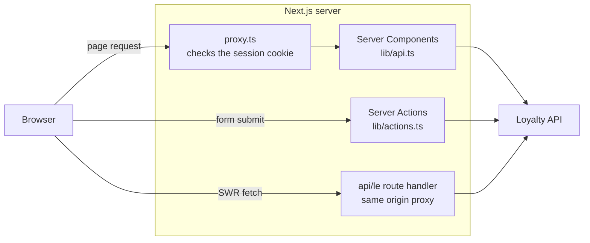

# Loyalty Engine Client

One Next.js project serving two separate apps:

- **Admin console** at `/admin`, used by staff to run the program.
- **Member app** at the root, used by the people in the program.

They share components and a design system but never share a session. The API
token stays on the server in both cases. See the [root README](../README.md) for
how this fits with the rest of the platform.

> **Read this first:** `AGENTS.md` in this folder warns that this is not the
> Next.js you already know. Next 16 renamed `middleware.ts` to **`proxy.ts`**,
> and `params` and `cookies()` are promises now. When something looks wrong,
> check `node_modules/next/dist/docs/` before assuming a bug.

## Routes

**Public, no session:**

| Path | What it does |
|---|---|
| `/` | Landing page with two tiles, one per app. |
| `/login` | Member sign in and sign up. Sends to `/home` if already signed in. |
| `/verify` | Where DOI verification emails of `type: "link"` land. Marked `noindex`. |
| `/admin/login` | Staff sign in. |

**Member session required:**

| Path | What it does |
|---|---|
| `/home` | Campaign launcher. Paste a URL and it opens in a frame that survives tab switches. |
| `/products` | Product catalog, purchase history and spend stats for the last 7 days. |
| `/wallet` | Points balance plus prizes and redemptions, refreshed automatically. |
| `/account` | Profile view and edit, and a button to copy the member id. |

**Admin session required:**

| Path | What it does |
|---|---|
| `/admin/dashboard` | Member stats, tier distribution, recent signups. |
| `/admin/members` | Member list, detail pages, points actions, granting rewards, assigning challenges. |
| `/admin/members/configure` | Define the custom attributes members can carry. |
| `/admin/segments` | Manage segments and bulk assign members to them. |
| `/admin/challenges` | Create challenges and hand them out. |
| `/admin/events` | Define events and the rules that decide what each one earns. A member's events show on their detail page. |
| `/admin/rewards`, `/admin/products`, `/admin/tiers` | Catalog and program setup. |

`/verify` sits outside the protected groups on purpose. The people opening it are
members following an email link, not staff, and they will never have a session.

## How data moves

The browser never calls the loyalty API and never touches the database. Every
path goes through the Next.js server, which is where the bearer token lives.



Three ways in, one way out:

1. **First paint** is server rendered. Server Components call `lib/api.ts`, a
   typed client that retries on 5xx and unwraps FastAPI error bodies.
2. **Writes** are Server Actions in `lib/actions.ts` and friends, which call the
   API and then `revalidatePath` to clear the router cache.
3. **Live reads** in the browser use SWR, pointed at `/api/le/<path>`. That route
   checks the admin session, then forwards upstream with the token attached.

`lib/server/upstream.ts` imports `server-only`, so importing it from a Client
Component breaks the build rather than leaking the token to the browser.

## Sessions

No Supabase auth, no NextAuth. Sessions are HMAC signed cookies, httpOnly, and
`secure` in production.

| | Admin | Member |
|---|---|---|
| Cookie | `admin_session` | `member_session` |
| Lifetime | 7 days | 30 days |
| Sign in | Username and password, compared in constant time | Email plus a code mailed by the API |
| Guards | `/admin/**` | `/home`, `/products`, `/wallet`, `/account` |

`proxy.ts` is the gate. Each protected layout checks the session again, so a
routing mistake does not expose a page. Admin sign in also has a per IP lockout
of 3 failed attempts for 10 minutes, held in memory, so it resets when the
process restarts.

## Components

```
components/
├── ui/          27 primitives: Button, Card, Dialog, Table, Tabs, Toast,
│                StatTile, ProgressMeter, StatusBadge, Skeletons, icons
├── layout/      AppShell (admin sidebar), MemberShell (member tabs + campaign frame)
├── members/     list, detail, points actions, grant reward, assign challenge,
│                custom attribute fields, events card
├── challenges/  ChallengeCard, ChallengeFields
├── events/      event list and detail, the rule builder (RuleEditorDialog), rules.ts
├── campaigns/   CampaignContext, CampaignFrame, CampaignLauncher
├── products/    catalog, cards, buy button, purchase history
├── segments/    incl. AssignMembersDialog
├── rewards/, tiers/, account/, wallet/
```

The campaign frame is the one piece with unusual state: it keeps a campaign
loaded while the member moves between tabs, backed by `lib/campaign-storage.ts`.

## Setup

```bash
npm install
cp .env.example .env.local   # fill in the values below
npm run dev                  # http://localhost:3000
```

The API must be running first. Point `API_BASE_URL` at it.

| Variable | What it is for |
|---|---|
| `API_BASE_URL` | Base URL of the loyalty API. Defaults to `http://127.0.0.1:8000`. |
| `API_TOKEN` | Bearer token for the API. Must match the API's own `API_TOKEN`. |
| `ADMIN_USERNAME`, `ADMIN_PASSWORD` | Staff console credentials. Missing values throw at startup. |
| `AUTH_SECRET` | HMAC key that signs both session cookies. |

Every variable is server side. There are no `NEXT_PUBLIC_*` variables, which is
deliberate: nothing about the API should reach the browser bundle.

## Stack

| | |
|---|---|
| Framework | Next.js 16.2, React 19.2, App Router |
| Data fetching | Server Components, Server Actions, SWR 2.4 for live reads |
| Styling | Tailwind CSS v4, configured in `app/globals.css` rather than a config file |
| Language | TypeScript 5 |
| Linting | ESLint 9 flat config, `next/core-web-vitals` plus TypeScript rules |

```bash
npm run dev     # development server
npm run build   # production build
npm run start   # serve the build
npm run lint    # eslint
```

## Known rough edges

- **No tests.** No runner, no config, no test files.
- `/admin/test-btn` is a leftover scratch page and can go.
- `public/` still carries create-next-app artwork (`next.svg`, `vercel.svg`,
  `window.svg`, `file.svg`, `globe.svg`) next to the real `logo.svg`.
