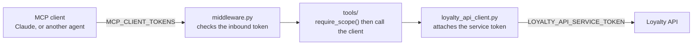

# Loyalty Engine MCP Server

Exposes the [loyalty API](../api) to AI agents as [MCP](https://modelcontextprotocol.io)
tools, over the Streamable HTTP transport. It never touches the database. Every
tool turns into an HTTP call to the API, the same way any other client would do
it, so the business rules stay in one place.



## Status

Four phases are done:

1. **Scaffold**, config, auth, HTTP client, server entrypoint.
2. **Read tools**, members, segments, rewards, tiers, balances, transactions,
   redemptions.
3. **Write tools**, create and update a member, earn and burn points, redeem a
   reward, trigger and verify DOI email.
4. **Challenges, prizes, products and purchases**, the full challenge lifecycle
   plus the catalog behind purchase based flows.

Held back for a later admin scope: deleting members, rewards, tiers and segments,
admin point adjustments, reward, tier and segment writes, and member custom
attribute definitions.

Member sign in (`/auth/signup`, `/auth/login`, `/auth/verify`) is deliberately
left off. It is a credential flow, and brokering it through an external agent
would be the wrong place for it.

## Two tokens, on purpose

| | Inbound | Outbound |
|---|---|---|
| Variable | `MCP_CLIENT_TOKENS` | `LOYALTY_API_SERVICE_TOKEN` |
| Answers | Which agent is calling this server, and what may it do | How this server proves itself to the loyalty API |
| Checked by | `app/core/middleware.py`, before any MCP handling | Sent on every outbound call, whoever asked |
| Seen by clients | Their own token only | Never |

The point of the split is revocation. Dropping a misbehaving caller means editing
`MCP_CLIENT_TOKENS`. The loyalty API's own credential never has to rotate.

Scopes are `read`, `write` and `admin`, where `admin` satisfies any check. Every
tool calls `require_scope(...)` on its first line, so a caller without the scope
gets a tool error rather than a quiet partial result.

## Project layout

Mirrors `api/app`. Tools only translate MCP calls into HTTP calls, since the
logic already lives in the API.

```
mcp-server/
├── requirements.txt
├── .env.example
├── bundle/                 # the .mcpb Claude Desktop installs, see Desktop bundle
│   ├── manifest.json
│   ├── icon.png
│   └── build.sh
└── app/
    ├── server.py           # ASGI entrypoint: `uvicorn app.server:app`
    ├── mcp_instance.py     # the shared MCPServer instance tools register onto
    ├── core/
    │   ├── config.py       # env vars, read in one place
    │   ├── auth.py         # token to principal, require_scope()
    │   ├── annotations.py  # the behaviour hints each tool declares
    │   ├── branding.py     # the icons sent in the initialize response
    │   └── middleware.py   # ASGI bearer auth
    ├── assets/
    │   ├── logo.svg        # copy of client/public/logo.svg
    │   └── logo-64.png     # rendered from that SVG
    ├── client/
    │   └── loyalty_api_client.py   # the only module that knows the API
    └── tools/              # one module per resource, mirrors api/app/routers/
        ├── members.py
        ├── points.py
        ├── challenges.py
        ├── redemptions.py
        ├── rewards.py
        ├── products.py
        ├── purchases.py
        ├── segments.py
        ├── tiers.py
        └── doi.py
```

## Setup

```bash
python3 -m venv venv
source venv/bin/activate
pip install -r requirements.txt
cp .env.example .env
```

| Variable | What it is for |
|---|---|
| `LOYALTY_API_BASE_URL` | Where the loyalty API is running. |
| `LOYALTY_API_SERVICE_TOKEN` | The API's own `API_TOKEN`. |
| `MCP_CLIENT_TOKENS` | JSON array of callers, each with a token, a name and scopes. |
| `LOYALTY_API_TIMEOUT_SECONDS` | Optional, defaults to 15. |

## Running

```bash
uvicorn app.server:app --reload --port 8100
```

- MCP endpoint: `http://localhost:8100/mcp`
- Health check, no auth: `http://localhost:8100/healthz`

Point a client at `/mcp` with `Authorization: Bearer <one of MCP_CLIENT_TOKENS>`.

## Tool reference

40 tools. Inputs use snake_case field names, outputs pass the API response
straight through, already camelCase. The headings below group by domain for
reading only; the title a client actually shows is verb first, see
[How tools are grouped](#how-tools-are-grouped).

**Members**

| Scope | Tool | API call |
|---|---|---|
| `read` | `list_members(q?, skip?, limit?)` | `GET /members` |
| `read` | `get_member(member_id)` | `GET /members/{id}` |
| `write` | `create_member(name, email, phone?, segment_ids?, custom_attributes?)` | `POST /members` |
| `write` | `update_member(member_id, ...)` | `PATCH /members/{id}` |

**Points**

| Scope | Tool | API call |
|---|---|---|
| `read` | `get_member_balance(member_id)` | `GET /members/{id}/balance` |
| `read` | `list_transactions(member_id, skip?, limit?)` | `GET /members/{id}/transactions` |
| `write` | `earn_points(member_id, points, description?)` | `POST /members/{id}/points/earn` |
| `write` | `burn_points(member_id, points, description?)` | `POST /members/{id}/points/burn` |

**Rewards, redemptions and prizes**

| Scope | Tool | API call |
|---|---|---|
| `read` | `list_rewards(active_only?, skip?, limit?)` | `GET /rewards` |
| `read` | `get_reward(reward_id)` | `GET /rewards/{id}` |
| `write` | `redeem_reward(member_id, reward_id)` | `POST /members/{id}/redeem/{rewardId}` |
| `read` | `list_member_redemptions(member_id, skip?, limit?)` | `GET /members/{id}/redemptions` |
| `write` | `assign_prize(member_id, reward_id)` | `POST /members/{id}/prizes/{rewardId}` |
| `read` | `list_member_prizes(member_id, source?, skip?, limit?)` | `GET /members/{id}/prizes` |

**Challenges**

| Scope | Tool | API call |
|---|---|---|
| `write` | `create_challenge(name, target_value?, reward_points?, reward_id?, ...)` | `POST /challenges` |
| `read` | `list_challenges(active_only?, skip?, limit?)` | `GET /challenges` |
| `read` | `get_challenge(challenge_id)` | `GET /challenges/{id}` |
| `write` | `update_challenge(challenge_id, ...)` | `PATCH /challenges/{id}` |
| `write` | `delete_challenge(challenge_id)` | `DELETE /challenges/{id}` |
| `write` | `assign_challenge_to_member(member_id, challenge_id)` | `POST /members/{id}/challenges/{id}` |
| `read` | `list_member_challenges(member_id, status?, skip?, limit?)` | `GET /members/{id}/challenges` |
| `read` | `get_member_challenge_progress(member_id, challenge_id)` | `GET /members/{id}/challenges/{id}` |
| `write` | `update_challenge_progress(member_id, challenge_id, amount?, description?)` | `POST /members/{id}/challenges/{id}/progress` |
| `write` | `complete_challenge(member_id, challenge_id)` | `POST /members/{id}/challenges/{id}/complete` |
| `write` | `unassign_challenge(member_id, challenge_id)` | `DELETE /members/{id}/challenges/{id}` |
| `write` | `assign_challenge_to_segment(challenge_id, segment_id)` | `POST /challenges/{id}/assign-segment` |

**Products and purchases**

| Scope | Tool | API call |
|---|---|---|
| `write` | `create_product(name, price_cents, ...)` | `POST /products` |
| `read` | `list_products(active_only?, skip?, limit?)` | `GET /products` |
| `read` | `get_product(product_id)` | `GET /products/{id}` |
| `write` | `update_product(product_id, ...)` | `PATCH /products/{id}` |
| `write` | `delete_product(product_id)` | `DELETE /products/{id}` |
| `write` | `purchase_product(member_id, product_id, quantity?)` | `POST /members/{id}/purchases` |
| `read` | `list_member_purchases(member_id, skip?, limit?)` | `GET /members/{id}/purchases` |
| `read` | `get_member_purchase_stats(member_id, days?)` | `GET /members/{id}/purchase-stats` |

**Segments, tiers and DOI**

| Scope | Tool | API call |
|---|---|---|
| `read` | `list_segments()` | `GET /segments` |
| `read` | `get_segment(segment_id)` | `GET /segments/{id}` |
| `read` | `list_tiers()` | `GET /tiers` |
| `read` | `get_tier(tier_id)` | `GET /tiers/{id}` |
| `write` | `trigger_doi(email?, member_id?, type?)` | `POST /doi/trigger` |
| `write` | `verify_doi(code, email?, member_id?)` | `POST /doi/verify` |

## Adding a tool

1. Add the function to the matching module in `app/tools/`, or create a new
   module and import it in `app/tools/__init__.py`.
2. Give it a verb-first `title` in the `"<Verb> <object>"` shape, such as
   `Create Challenge` or `List Member Purchases`. No domain prefix. See
   [How tools are grouped](#how-tools-are-grouped).
3. Pass `annotations=ann.READ`, `ann.WRITE` or `ann.DELETE` from
   `app/core/annotations.py`, matching the scope in the next step. `ann.DELETE`
   is for tools that remove a record and nothing else. Always pass one: the two
   tools that pass nothing do so for a documented reason, see
   [How tools are grouped](#how-tools-are-grouped).
4. Call `require_scope("read")` or `require_scope("write")` first.
5. Call the API through `app.client.loyalty_api_client`, never `httpx` directly.
   That keeps the transport mockable and the service token in one place.
6. Add a row to the table above.

## Error handling

A non 2xx answer from the loyalty API raises `LoyaltyAPIError` inside the tool.
MCP turns that into a tool error carrying the API's own `detail` message, for
example `404: Member not found`.

## How tools are grouped

A client sorts this server's 42 tools along two axes, and they work differently.

### By behaviour, which the protocol does support

Forty of the 42 declare `annotations` from `app/core/annotations.py`:

| Preset | Tools | `readOnlyHint` | `destructiveHint` | `openWorldHint` |
|---|---|---|---|---|
| `READ` | 22 | `true` | `false` | `false` |
| `WRITE` | 15 | `false` | `false` | `false` |
| `DELETE` | 3 | `false` | `true` | `false` |
| *(none)* | 2 | — | — | — |

`DELETE` means the tool removes a record and nothing else, which is three of
them: `delete_challenge`, `delete_product` and `unassign_challenge`.
`burn_points` is a `WRITE` despite spending a balance, because what it actually
does is append a transaction; no record goes away. `openWorldHint` is `false`
throughout, because every tool that declares a preset addresses one loyalty API
holding a closed, enumerable set of entities.

Note that `destructiveHint` defaults to *true* when omitted, so the writes have
to say `false` out loud rather than stay silent, otherwise they read as deletes.

**How Claude draws this.** Its connector settings screen reads `readOnlyHint`
and nothing else, giving three sections:

| Section | Comes from | Tools |
|---|---|---|
| **Read-only tools** | `readOnlyHint: true` | 22 |
| **Write/delete tools** | `readOnlyHint: false` | 18 |
| **Other tools** | no `annotations` at all | 2 |

Those headings are Claude's. A server cannot rename them or ask for a fourth,
and `destructiveHint` draws no section of its own, so the three `DELETE` tools
sit inside **Write/delete tools** with the writes. What `DELETE` does buy is
the marking that drives a client's confirmation prompt before an irreversible
call, which is worth having whether or not it shows up as a heading.

**Other tools** is the one section a server can aim a tool at, by annotating
nothing, and the two DOI tools use it on purpose. They are the only tools here
that reach an address outside the system, so a separate section with its own
allow/ask toggle is the right place for them, and going unannotated is the only
way to land there. The cost is real: no hints means no `openWorldHint: true`
saying why they are different, and no read/write signal at all. That trade is
worth it for exactly these two. Everything else declares a preset.

The hints are hints. `require_scope(...)` on the tool's first line is the
actual gate, and it runs whatever a client believes.

### By domain, which the protocol does not support

There is no way to tell a client that `earn_points` belongs to a "Points"
group. A `Tool` carries a name, a title, a description, its schemas, icons and
`_meta`, and nothing else, so a server cannot ask for the headings used in the
tool reference above. [SEP-1300](https://github.com/modelcontextprotocol/modelcontextprotocol/issues/1300)
proposed exactly that, groups and tags on `tools/list`, and was closed without
being adopted; the 2026-07-28 spec does not contain it.

What a client does display is the title, with precedence `title`, then
`annotations.title`, then `name`. Titles here used to exploit that with a
`"<Domain>: <action>"` prefix, on the theory that a client sorts by what it
shows, so a shared prefix would make related tools sit together and fake the
missing grouping.

That theory is wrong, at least for Claude. **Claude's connector settings screen
orders each bucket by the tool `name`, not by the title it draws.** The observed
order is `get_challenge`, `get_member`, `get_member_balance`,
`get_member_challenge_progress`, ... which renders as:

```
Get Challenge
Get Member
Get Points Balance              <- get_member_balance
Get Member Challenge Progress
```

Alphabetical in `name`, visibly out of order in the titles. So the prefix never
controlled placement, and the domain prefix bought nothing it was added for.

It has been dropped. Titles are now verb first, reading as the action the tool
performs:

| Was | Now |
|---|---|
| `Challenges: Assign to member` | `Assign Challenge to Member` |
| `Challenges: Create` | `Create Challenge` |
| `Points: Burn` | `Burn Points` |

The lever that does control order is the function name in `app/tools/`. Where a
name and its title disagree the list reads as unsorted, which is worth keeping
in mind when adding a tool: name it after its title and it lands where a reader
expects.

## Branding

The server sends its logo in the `initialize` response, as `icons` on
`serverInfo`. Two entries go out, together about 6.5 KB:

| File | Type | Sizes | Why |
|---|---|---|---|
| `app/assets/logo-64.png` | `image/png` | `64x64` | Every client that draws icons has to support PNG. Listed first. |
| `app/assets/logo.svg` | `image/svg+xml` | `any` | Scales cleanly for clients that support it. |

Both are inlined as `data:` URIs rather than https links, so drawing the icon
never depends on another deployment being reachable.

`app/assets/logo.svg` is a copy of the admin console's `client/public/logo.svg`,
which keeps this service deployable on its own. Change one and change the other,
then re-render the PNG:

```bash
pip install cairosvg
python -c "import cairosvg; cairosvg.svg2png(url='app/assets/logo.svg', write_to='app/assets/logo-64.png', output_width=64, output_height=64)"
```

`cairosvg` is a one off tool for that command, not a runtime dependency, so it
stays out of `requirements.txt`.

Worth knowing: this is the correct shape and there is nothing further to do on
the server. Rendering is entirely up to the client, and claude.ai does not read
`serverInfo.icons` for custom connectors yet, so the connector still shows a
generic avatar. That is tracked in
[claude-ai-mcp#152](https://github.com/anthropics/claude-ai-mcp/issues/152),
open and unanswered, alongside
[claude-code#95558](https://github.com/anthropics/claude-code/issues/95558) for
the CLI. Branded icons on Claude's own connectors are configured by Anthropic,
not sent by those servers. No server-side change, and no other MCP library,
moves this: the icon appears when client support lands.

Which leaves one place a logo does render today, and it is not the protocol:
the desktop bundle below, where the icon is a file in the archive rather than a
field on the wire.

The `Icon` type also carries a `theme` field (`light` or `dark`), and `Tool`
carries its own `icons` list. Neither is used here, since no client draws
either yet.

## Desktop bundle

`bundle/` packages this server as an
[MCPB](https://github.com/modelcontextprotocol/mcpb), the one-click install
format Claude Desktop reads. Claude Desktop draws `bundle/icon.png` beside the
extension, so installing the `.mcpb` is currently the only way to see the logo
next to this server in a Claude client.

The bundle ships no code of ours. Claude Desktop speaks stdio to extensions,
this server speaks Streamable HTTP, so the archive carries
[`mcp-remote`](https://www.npmjs.com/package/mcp-remote) as the proxy between
the two and nothing else. The tools still run on the deployment; the desktop
only gets a pipe to it.

```bash
./bundle/build.sh          # npm install, then mcpb pack
```

That writes `bundle/loyalty-engine-mcp.mcpb` (about 1.7 MB). Drag it onto
Claude Desktop, or use Settings, Extensions, Advanced settings, Install
Extension. The install prompt asks for the two values in `user_config`:

| Field | Value |
|---|---|
| MCP endpoint | The deployment's URL, ending in `/mcp`. |
| Client token | One of the tokens in `MCP_CLIENT_TOKENS`. Stored by Claude Desktop as a secret, since the field is marked `sensitive`. |

`icon.png` is 512x512, the size Claude Desktop asks for, rendered from the same
`app/assets/logo.svg` the `initialize` icons come from:

```bash
npx --yes sharp-cli -i app/assets/logo.svg -o bundle/icon.png resize 512 512
```

Two things to know before leaning on this. The token is passed as an
`--header` argument, so it is visible in the process list to anyone already on
that machine; `mcp-remote` also accepts `--header-file` if that matters for a
given install. And the bundle is a Claude Desktop format: it does nothing for
claude.ai in a browser, where the connector keeps its generic avatar, and
nothing for Claude Code, which draws no images at all.
