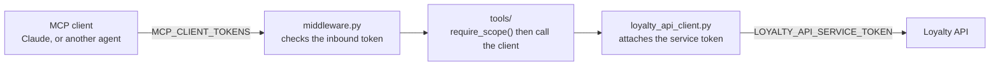

# Loyalty Engine MCP Server

Exposes the [loyalty API](../api) to AI agents as [MCP](https://modelcontextprotocol.io)
tools, over the Streamable HTTP transport. It never touches the database. Every
tool turns into an HTTP call to the API, the same way any other client would do
it, so the business rules stay in one place.



## Status

Four phases are done:

1. **Scaffold**, config, auth, HTTP client, server entrypoint.
2. **Read tools**, members, segments, rewards, tiers, balances, transactions,
   redemptions.
3. **Write tools**, create and update a member, earn and burn points, redeem a
   reward, trigger and verify DOI email.
4. **Challenges, prizes, products and purchases**, the full challenge lifecycle
   plus the catalog behind purchase based flows.

Held back for a later admin scope: deleting members, rewards, tiers and segments,
admin point adjustments, reward, tier and segment writes, and member custom
attribute definitions.

Member sign in (`/auth/signup`, `/auth/login`, `/auth/verify`) is deliberately
left off. It is a credential flow, and brokering it through an external agent
would be the wrong place for it.

## Two tokens, on purpose

| | Inbound | Outbound |
|---|---|---|
| Variable | `MCP_CLIENT_TOKENS` | `LOYALTY_API_SERVICE_TOKEN` |
| Answers | Which agent is calling this server, and what may it do | How this server proves itself to the loyalty API |
| Checked by | `app/core/middleware.py`, before any MCP handling | Sent on every outbound call, whoever asked |
| Seen by clients | Their own token only | Never |

The point of the split is revocation. Dropping a misbehaving caller means editing
`MCP_CLIENT_TOKENS`. The loyalty API's own credential never has to rotate.

Scopes are `read`, `write` and `admin`, where `admin` satisfies any check. Every
tool calls `require_scope(...)` on its first line, so a caller without the scope
gets a tool error rather than a quiet partial result.

## Project layout

Mirrors `api/app`. Tools only translate MCP calls into HTTP calls, since the
logic already lives in the API.

```
mcp-server/
├── requirements.txt
├── .env.example
└── app/
    ├── server.py           # ASGI entrypoint: `uvicorn app.server:app`
    ├── mcp_instance.py     # the shared MCPServer instance tools register onto
    ├── core/
    │   ├── config.py       # env vars, read in one place
    │   ├── auth.py         # token to principal, require_scope()
    │   └── middleware.py   # ASGI bearer auth
    ├── client/
    │   └── loyalty_api_client.py   # the only module that knows the API
    └── tools/              # one module per resource, mirrors api/app/routers/
        ├── members.py
        ├── points.py
        ├── challenges.py
        ├── redemptions.py
        ├── rewards.py
        ├── products.py
        ├── purchases.py
        ├── segments.py
        ├── tiers.py
        └── doi.py
```

## Setup

```bash
python3 -m venv venv
source venv/bin/activate
pip install -r requirements.txt
cp .env.example .env
```

| Variable | What it is for |
|---|---|
| `LOYALTY_API_BASE_URL` | Where the loyalty API is running. |
| `LOYALTY_API_SERVICE_TOKEN` | The API's own `API_TOKEN`. |
| `MCP_CLIENT_TOKENS` | JSON array of callers, each with a token, a name and scopes. |
| `LOYALTY_API_TIMEOUT_SECONDS` | Optional, defaults to 15. |

## Running

```bash
uvicorn app.server:app --reload --port 8100
```

- MCP endpoint: `http://localhost:8100/mcp`
- Health check, no auth: `http://localhost:8100/healthz`

Point a client at `/mcp` with `Authorization: Bearer <one of MCP_CLIENT_TOKENS>`.

## Tool reference

40 tools. Inputs use snake_case field names, outputs pass the API response
straight through, already camelCase.

**Members**

| Scope | Tool | API call |
|---|---|---|
| `read` | `list_members(q?, skip?, limit?)` | `GET /members` |
| `read` | `get_member(member_id)` | `GET /members/{id}` |
| `write` | `create_member(name, email, phone?, segment_ids?, custom_attributes?)` | `POST /members` |
| `write` | `update_member(member_id, ...)` | `PATCH /members/{id}` |

**Points**

| Scope | Tool | API call |
|---|---|---|
| `read` | `get_member_balance(member_id)` | `GET /members/{id}/balance` |
| `read` | `list_transactions(member_id, skip?, limit?)` | `GET /members/{id}/transactions` |
| `write` | `earn_points(member_id, points, description?)` | `POST /members/{id}/points/earn` |
| `write` | `burn_points(member_id, points, description?)` | `POST /members/{id}/points/burn` |

**Rewards, redemptions and prizes**

| Scope | Tool | API call |
|---|---|---|
| `read` | `list_rewards(active_only?, skip?, limit?)` | `GET /rewards` |
| `read` | `get_reward(reward_id)` | `GET /rewards/{id}` |
| `write` | `redeem_reward(member_id, reward_id)` | `POST /members/{id}/redeem/{rewardId}` |
| `read` | `list_member_redemptions(member_id, skip?, limit?)` | `GET /members/{id}/redemptions` |
| `write` | `assign_prize(member_id, reward_id)` | `POST /members/{id}/prizes/{rewardId}` |
| `read` | `list_member_prizes(member_id, source?, skip?, limit?)` | `GET /members/{id}/prizes` |

**Challenges**

| Scope | Tool | API call |
|---|---|---|
| `write` | `create_challenge(name, target_value?, reward_points?, reward_id?, ...)` | `POST /challenges` |
| `read` | `list_challenges(active_only?, skip?, limit?)` | `GET /challenges` |
| `read` | `get_challenge(challenge_id)` | `GET /challenges/{id}` |
| `write` | `update_challenge(challenge_id, ...)` | `PATCH /challenges/{id}` |
| `write` | `delete_challenge(challenge_id)` | `DELETE /challenges/{id}` |
| `write` | `assign_challenge_to_member(member_id, challenge_id)` | `POST /members/{id}/challenges/{id}` |
| `read` | `list_member_challenges(member_id, status?, skip?, limit?)` | `GET /members/{id}/challenges` |
| `read` | `get_member_challenge_progress(member_id, challenge_id)` | `GET /members/{id}/challenges/{id}` |
| `write` | `update_challenge_progress(member_id, challenge_id, amount?, description?)` | `POST /members/{id}/challenges/{id}/progress` |
| `write` | `complete_challenge(member_id, challenge_id)` | `POST /members/{id}/challenges/{id}/complete` |
| `write` | `unassign_challenge(member_id, challenge_id)` | `DELETE /members/{id}/challenges/{id}` |
| `write` | `assign_challenge_to_segment(challenge_id, segment_id)` | `POST /challenges/{id}/assign-segment` |

**Products and purchases**

| Scope | Tool | API call |
|---|---|---|
| `write` | `create_product(name, price_cents, ...)` | `POST /products` |
| `read` | `list_products(active_only?, skip?, limit?)` | `GET /products` |
| `read` | `get_product(product_id)` | `GET /products/{id}` |
| `write` | `update_product(product_id, ...)` | `PATCH /products/{id}` |
| `write` | `delete_product(product_id)` | `DELETE /products/{id}` |
| `write` | `purchase_product(member_id, product_id, quantity?)` | `POST /members/{id}/purchases` |
| `read` | `list_member_purchases(member_id, skip?, limit?)` | `GET /members/{id}/purchases` |
| `read` | `get_member_purchase_stats(member_id, days?)` | `GET /members/{id}/purchase-stats` |

**Segments, tiers and DOI**

| Scope | Tool | API call |
|---|---|---|
| `read` | `list_segments()` | `GET /segments` |
| `read` | `get_segment(segment_id)` | `GET /segments/{id}` |
| `read` | `list_tiers()` | `GET /tiers` |
| `read` | `get_tier(tier_id)` | `GET /tiers/{id}` |
| `write` | `trigger_doi(email?, member_id?, type?)` | `POST /doi/trigger` |
| `write` | `verify_doi(code, email?, member_id?)` | `POST /doi/verify` |

## Adding a tool

1. Add the function to the matching module in `app/tools/`, or create a new
   module and import it in `app/tools/__init__.py`.
2. Call `require_scope("read")` or `require_scope("write")` first.
3. Call the API through `app.client.loyalty_api_client`, never `httpx` directly.
   That keeps the transport mockable and the service token in one place.
4. Add a row to the table above.

## Error handling

A non 2xx answer from the loyalty API raises `LoyaltyAPIError` inside the tool.
MCP turns that into a tool error carrying the API's own `detail` message, for
example `404: Member not found`.

## A note on how tools appear in clients

MCP has no concept of tool groups. A `Tool` carries a name, a title, a
description and its schemas, and nothing else, so a client cannot render the
domain headings used above. In the Claude connector settings all 40 land under
**Other tools**. Server icons are part of the spec but Claude does not render
them for custom connectors yet, which is why the connector shows a generic
avatar.
