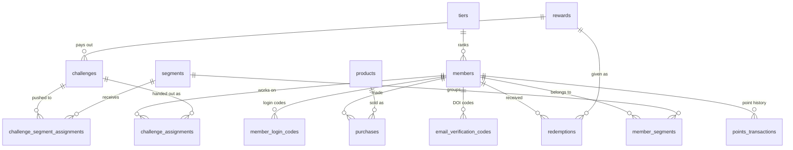

# Database

The loyalty engine stores everything in one Supabase Postgres database. This
folder holds the SQL migrations. Only the [API](../api) connects to the database,
so this is the only place schema changes are written by hand.

## Why migrations exist at all

The API creates tables on startup with SQLAlchemy `create_all`. That helper has
one hard limit worth remembering:

> `create_all` creates tables that do not exist yet. It never alters a table that
> does exist.

So the split is:

| Change | How it happens |
|---|---|
| A brand new table | Automatic. Start the API and it appears. |
| A new column, a dropped column, a changed type, an index, an enum value | Manual. Write SQL here and run it against Supabase first. |

Run the SQL before deploying the code that depends on it. Otherwise the API
starts against a table that is missing the column it expects.

## Applying a migration

Either paste the file into the Supabase SQL editor, or use the Supabase CLI if
the project is linked:

```bash
supabase db push          # apply local migrations to the linked project
supabase db pull          # pull the live schema back into a new migration file
```

`20260914092017_remote_schema.sql` is a full snapshot produced by `db pull`. It
replaced the older per feature migration files, so it is the one file that
describes the whole schema today.

## What the schema looks like



Fifteen tables in total. `member_attributes` is the one not drawn above: it holds
admin defined custom field definitions and links to nothing, since the values
themselves live in a JSON column on `members`.

Deleting a member clears their segments, transactions, redemptions, purchases,
challenge assignments and codes along with them. Deleting a reward or a product
is gentler: challenges keep working with `reward_id` set to null, and purchases
keep the product name they recorded at the time.

## Enums

| Type | Values |
|---|---|
| `transactiontype` | `earn`, `spend`, `adjust` |
| `redemptionsource` | `redeemed`, `assigned` |
| `challengestatus` | `assigned`, `in_progress`, `completed`, `expired`, `cancelled` |
| `doitype` | `code`, `link` |

Adding a value to one of these is a schema change, so it needs a migration here.

## Connection notes

Use the **transaction pooler** on port `6543`, not the session pooler on `5432`.
Session mode gives every client its own Postgres backend out of a budget of about
15, which a serverless deployment burns through almost at once. The API rewrites a
session mode URL to `6543` at startup and logs a warning, but fix the
`DATABASE_URL` rather than leaning on that. See [api/README.md](../api/README.md)
for the full setup.
